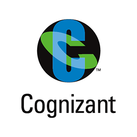
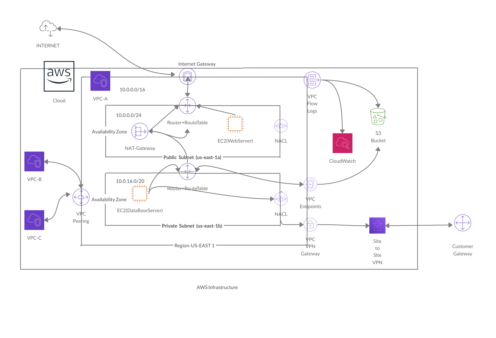

<!DOCTYPE html>
<html>
	<head>
		<title>Abhishek Pandey</title>
		<link rel="stylesheet" type="text/css" href="Resume.css">
		<link rel="stylesheet" href="https://use.fontawesome.com/releases/v5.14.0/css/all.css" integrity="sha384-HzLeBuhoNPvSl5KYnjx0BT+WB0QEEqLprO+NBkkk5gbc67FTaL7XIGa2w1L0Xbgc" crossorigin="anonymous">
		
		<meta name="viewport" content="width=device-width",initial-scale=1>
		<meta name="viewport" content="width=small",initial-scale=1>
	</head>
	<body>
		<header id="header-body">
			
	<!-- 		<nav>
				<ul class="horizontal-lists text-center nav-menu" style="margin-top: 15px;">
					<li><a href="#Home"> Home </a></li>
					<li><a href="#about"> About </a></li>
					<li><a href="#skills"> Skills </a></li>
					<li><a href="#experience"> Experience </a></li>
					<li><a href="#certifications"> Certifications </a></li>
					<li><a href="#portfolio"> Portfolio </a></li>
					<li><a href="#contact"> Contact </a></li>
				</ul>			
			</nav>
	 -->
			

				

					<h1 id="MyName">Abhishek Pandey</h1>
				

				
				

					<ul class="horizontal-lists text-center social-icons">
						<li><a href="https://www.linkedin.com/in/abhishek-pandey-906997b7/" target="_blank"><ion-icon name="logo-linkedin"></ion-icon></a></li>
						<li><a href="https://github.com/Abhishek-172" target="_blank"><ion-icon name="logo-github"></ion-icon></a></li>
						<li><a href="https://stackoverflow.com/story/abhishekpandey172" target="_blank"><ion-icon name="logo-stackoverflow"></ion-icon></a></li>
					</ul>
				

			

		</header>
		<main>
			<section id="about">
				

					
				

				

					<blockquote>
						
<i style="color: darkgrey;" class="fa fa-quote-left" aria-hidden="true"></i>
						An Engineer, always looking to explore new fields and build new things.<i style="color: darkgrey;"class="fa fa-quote-right" aria-hidden="true"></i>

					</blockquote>
				

			</section>

			<section id="skills">
				<h1 class="section-heading mb75px">
					
						<i class="fa fa-terminal" aria-hidden="true"></i>
					
					Skills
				</h1>

				

					
					
<h1>Web Technologies Known:</h1>

					

						

							<ion-icon style="height:90px; width:90px;" name="logo-html5"></ion-icon>
							

								<h4 style="text-align: center;">HTML</h4>
							

						

						

							<ion-icon style="height:90px; width:90px;" name="logo-css3"></ion-icon>
							

								<h4 style="text-align: center;">CSS</h4>
							

						

						

							<ion-icon style="height:90px; width:90px;" name="logo-javascript"></ion-icon>
							

								<h4 style="text-align: center;">JavaScript</h4>
							

						

						

							<ion-icon style="height:90px; width:90px;" name="logo-angular"></ion-icon>
							

								<h4 style="text-align: center;">AngularJS</h4>
							

						

						

							<ion-icon style="height:90px; width:90px;" name="logo-nodejs"></ion-icon>
							

								<h4 style="text-align: center;">NodeJS</h4>
							

						

					

					
					
<h1>Programming Language Known:</h1>

					

						

							<ion-icon style="height:90px; width:90px;" name="logo-python"></ion-icon>
							

								<h4 style="text-align: center;">Python</h4>	
							

						

					

					
<h1>Cloud Platform Known:</h1>

					

						

							<ion-icon style="height:90px; width:90px;" name="cloud-circle-outline"></ion-icon>
							

								<h4 style="text-align: center;">Amazon Web Services</h4>	
							

						

					

				

			</section>

			<section id="experience" class="mb75px skills-display-flex">
				<h1 class="section-heading mb75px">
					
						<ion-icon name="briefcase-sharp"></ion-icon>
					
					 Work Experience 
				</h1>
				

					

						
						

							<h2>AWS Developer</h2>
							<h3 style="margin-top: -10px;">Cognizant Technology Solutions</h3>
							<h4 style="margin-top: -10px;">12/2018 - 05/2020 &emsp;&emsp;&emsp;&emsp;&emsp;&emsp;&emsp;&emsp;&emsp;&emsp;&emsp;&emsp;&emsp;Pune, India</h4>
							<h5>Deep understanding and hands on experience in developing solutions in Cloud platform.</h5>
							<h5 style="margin-top: -15px;">Experience in aligning metrics to business needs so that responses are effective at maintaining business continuity</h5>
							<h5 style="margin-top: -15px;">Progressive experience architecting, design, and engineering global enterprise IT solutions.</h5>
							<h5 style="margin-top: -15px;">Hands on experience with EC2, ECS, ELB, EBS, S3, VPC, IAM,SQS, RDS, CloudWatch, Cloud Formation, Elastic Beanstalk and Autoscaling.</h5>
						

					

					

						
						

							<h2>Documentum Analyst</h2>
							<h3 style="margin-top: -10px;">Cognizant Technology Solutions</h3>
							<h4 style="margin-top: -10px;">06/2018 - 11/2018 &emsp;&emsp;&emsp;&emsp;&emsp;&emsp;&emsp;&emsp;&emsp;&emsp;&emsp;&emsp;&emsp;Chennai, India</h4>							
							<h5>Strong experience working on validated systems (CSV process)</h5>
							<h5 style="margin-top: -15px;">Good experience in ITIL process, more specific to LifeSciences domain</h5>
							<h5 style="margin-top: -15px;">Coordinate and work directly with the internal teams (Infrastructure, Database, BI and Platform) and Product Vendor (OpenText) and any external team during incident and problem resolution, follow up till closure.</h5>
							<h5 style="margin-top: -15px;">Perform Root cause analysis for the incidents as part of preventive maintenance.</h5>
							<h5>Interface with delivery groups to ensure complex problems are being worked appropriately and escalate incidents to Vendors</h5>
						

					

					

	                    

	                        

	                            <ion-icon style="height: 35px; width: 35px; transform: rotate(90deg); margin-left: -17px; " name="airplane-sharp"></ion-icon>
	                        

	                    

					

				
			</section>

			<section id="portfolio" class="mb75px" >
				<h1 class="section-heading mb75px">
					
						<ion-icon name="grid-outline"></ion-icon>
					
					 Portfolio 
				</h1>
				

					

						
						

							<a href="https://github.com/Abhishek-172/AWS-Infrastructure" target="_blank">
AWS-Infrastructure
</a>
						

					

				

			</section>
			
			<section id="certifications" class="mb75px">
				<h1 class="section-heading mb75px">
					
						<ion-icon name="ribbon-sharp"></ion-icon>
					
					 Certifications 
				</h1>
				

					
					
				

			</section>
			

			
			<section id="contact">
				
				

					<ion-icon name="person-add-outline"></ion-icon>
					Contact
				

				

					

						<form id="contact-form">
	                        <input id="input-name" name="name" type="text" placeholder="Your Name">
	                        <input id="input-email" name="input-email" type="text" required placeholder="Your Email">
	                        <input id="input-message" name="input-message" type="text" placeholder="Message"></input>
	                        <button class="sub-btn" type="submit">SEND MESSAGE</button>
	                    </form>	
					

				

				

					<ul class="horizontal-lists text-center social-icons">
						<li><a href="https://www.linkedin.com/in/abhishek-pandey-906997b7/" target="_blank"><ion-icon name="logo-linkedin"></ion-icon></a></li>
						<li><a href="https://github.com/Abhishek-172" target="_blank"><ion-icon name="logo-github"></ion-icon></a></li>
						<li><a href="https://stackoverflow.com/story/abhishekpandey172" target="_blank"><ion-icon name="logo-stackoverflow"></ion-icon></a></li>
					</ul>
				

			</section>	
		</main>
	</body>
</html>
